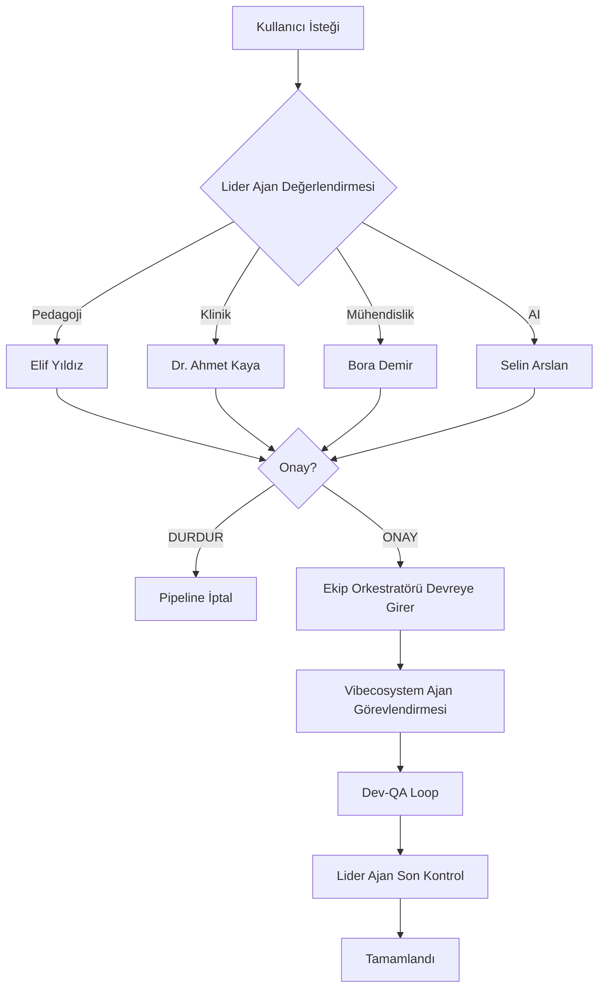

# Vibecosystem Ajan Entegrasyonu

## Genel Bakış

Bu dizin, [agency-agents](https://github.com/ashishpatel26/agency-agents) projesinden seçilen ve Oogmatik'e adapte edilen genel amaçlı ajanları içerir.

**ÖNEMLİ**: Bu ajanlar **lider ajanların koordinasyonu altında** çalışır. Hiçbir vibecosystem ajanı lider ajanların kararlarını geçemez.

---

## 🏗️ Dizin Yapısı

```
.claude/agents/vibecosystem/
├── engineering/           # Mühendislik ajanları
│   ├── frontend-dev.md
│   ├── backend-dev.md
│   ├── security-engineer.md
│   ├── ai-engineer.md
│   └── technical-writer.md
├── testing/              # Test ajanları
│   ├── evidence-collector.md
│   ├── reality-checker.md
│   ├── accessibility-auditor.md
│   └── api-tester.md
├── design/               # Tasarım ajanları
│   ├── ui-designer.md
│   └── ux-researcher.md
└── support/              # Destek ajanları
    ├── analytics-reporter.md
    └── legal-compliance.md
```

---

## 👑 Liderlik Hiyerarşisi

### Lider Ajanlar (İç Çekirdek)
Tüm kararların son onay mercii:

1. **Elif Yıldız** (`ozel-ogrenme-uzmani`) — Pedagoji
2. **Dr. Ahmet Kaya** (`ozel-egitim-uzmani`) — Klinik/MEB
3. **Bora Demir** (`yazilim-muhendisi`) — Mühendislik
4. **Selin Arslan** (`ai-muhendisi`) — AI Mimarisi

### Genel Kadro (Vibecosystem)
Lider ajanların direktifleriyle çalışır:

- `frontend-dev`, `backend-dev`, `security-engineer`, `ai-engineer`
- `evidence-collector`, `reality-checker`, `accessibility-auditor`
- `ui-designer`, `ux-researcher`
- `analytics-reporter`, `legal-compliance`

### Orkestratör
Çoklu ajan koordinasyonu:

- **Ekip Orkestratörü** (`ekip-orkestratoru`) — Pipeline yönetimi

---

## 🔄 Koordinasyon Protokolü



---

## 🎯 Ajan Seçim Kriterleri

### Oogmatik İçin Seçilen Ajanlar (15/120)

**Neden Sadece 15 Ajan?**
- Context şişmesini önlemek
- Oogmatik'e özgü görevlere odaklanmak
- Lider ajan koordinasyonunu basit tutmak

**Seçim Kriterleri**:
1. ✅ Eğitim teknolojisi relevansı
2. ✅ Özel eğitim uyumluluğu (accessibility, KVKK)
3. ✅ Teknik stack uyumu (React, TypeScript, Gemini)
4. ✅ Kalite kontrol yetenekleri
5. ❌ Generic ajanlar (örn: marketing, sales, game-dev)

### Seçilen Ajanlar

#### Engineering (6 ajan)
- **frontend-dev**: React bileşenleri, Lexend font, disleksi UI
- **backend-dev**: API endpoint, Firestore, rate limiting
- **security-engineer**: KVKK, güvenlik audit, veri gizliliği
- **ai-engineer**: Gemini entegrasyonu, prompt optimizasyonu
- **technical-writer**: Dokümantasyon, API referansı
- **devops-automator**: Vercel deploy, CI/CD

#### Testing (4 ajan)
- **evidence-collector**: Screenshot-based QA
- **reality-checker**: Production hazırlık kontrolü
- **accessibility-auditor**: WCAG 2.1 AA, disleksi uyumluluğu
- **api-tester**: Endpoint testing, performance

#### Design (2 ajan)
- **ui-designer**: UI design system, Lexend typography
- **ux-researcher**: Özel eğitim UX araştırması

#### Support (3 ajan)
- **analytics-reporter**: Usage metrics, teacher dashboard
- **legal-compliance**: KVKK, MEB yönetmelik uyumu
- **support-responder**: Öğretmen ve veli desteği

---

## 🛠️ Lokalizasyon ve Adaptasyon

Her ajan şu şekilde adapte edildi:

### 1. Türkçe Çeviri
- Ajan adları Türkçeleştirildi (opsiyonel)
- Tüm dokümantasyon Türkçe
- Örnekler Türkiye'ye özgü

### 2. Oogmatik Domain Bilgisi Eklendi
```markdown
## Oogmatik Özel Kuralları

### Pedagojik Standartlar
- Her aktivitede `pedagogicalNote` zorunlu
- ZPD uyumu: AgeGroup × Difficulty
- Disleksi tasarım: Lexend font, geniş satır aralığı

### Klinik Standartlar
- Tanı koyucu dil yasak
- KVKK uyumu: ad + tanı + skor birlikte görünmez
- MEB Özel Eğitim Yönetmeliği uyumu

### Teknik Standartlar
- TypeScript strict mode
- AppError formatı: { success, error: { message, code } }
- Rate limiting: RateLimiter servisi
- Gemini model: gemini-2.5-flash (sabit)
```

### 3. Lider Ajan Koordinasyon Kuralları
```markdown
## Lider Ajan Raporlama

**Her görev öncesi**:
@ozel-ogrenme-uzmani → Pedagojik onay
@yazilim-muhendisi → Teknik onay

**Her görev sonrası**:
İlgili lidere son kontrol raporu
```

---

## 📚 Kullanım Örnekleri

### Örnek 1: Yeni React Bileşeni

```bash
# 1. Kullanıcı isteği
"Disleksi-dostu bir kelime kartı bileşeni yap"

# 2. Lider ajan onayı
@ozel-ogrenme-uzmani: "Pedagojik onay: ZPD uyumlu, görsel destek var"
@yazilim-muhendisi: "Teknik onay: React 18 pattern'leri kullan"

# 3. Orkestratör devreye girer
@ekip-orkestratoru: "frontend-dev görevlendirildi"

# 4. Vibecosystem ajan çalışır
@frontend-dev: "React bileşeni oluşturuluyor..."
  → Lexend font kullanıldı
  → line-height: 1.8 uygulandı
  → Renk kontrast oranı AA seviyesi

# 5. QA testi
@accessibility-auditor: "WCAG 2.1 AA uyumu kontrol ediliyor..."
  → PASS: Disleksi standartlarına uygun

# 6. Lider son kontrol
@yazilim-muhendisi: "TypeScript strict mode uyumlu ✅"
@ozel-ogrenme-uzmani: "Pedagojik standartlar korundu ✅"
```

### Örnek 2: API Endpoint Güvenlik Audit

```bash
# 1. Kullanıcı isteği
"api/generate.ts'yi KVKK uyumluluğu için audit et"

# 2. Lider ajan onayı
@ozel-egitim-uzmani: "Klinik onay: öğrenci verisi korunmalı"
@yazilim-muhendisi: "Teknik onay: rate limiting kontrol et"

# 3. Orkestratör devreye girer
@ekip-orkestratoru: "security-engineer + legal-compliance görevlendirildi"

# 4. Vibecosystem ajanlar çalışır
@security-engineer: "Güvenlik audit yapılıyor..."
  → API key exposure: YOK
  → Input validation: Zod kullanılmış ✅
  → Rate limiting: RateLimiter aktif ✅

@legal-compliance: "KVKK uyumu kontrol ediliyor..."
  → Öğrenci adı + tanı birlikte loglanmıyor ✅
  → Veri minimizasyonu prensibi uygulanmış ✅

# 5. Lider son kontrol
@ozel-egitim-uzmani: "KVKK uyumluluğu onaylandı ✅"
```

---

## 🚀 Aktivasyon

### Manuel Aktivasyon
```bash
# Tek ajan çağırma
"@frontend-dev: Bu React bileşenini optimize et"

# Orkestratör ile çoklu ajan
"@ekip-orkestratoru: Yeni aktivite generatörü pipeline'ı başlat"
```

### Otomatik Aktivasyon (Planlanan)
```typescript
// services/agentOrchestrator.ts (gelecek implementasyon)
export async function autoActivateAgents(task: Task) {
  // 1. Task tipi analizi
  const taskType = analyzeTaskType(task);

  // 2. Lider ajan onayı
  const leaderApprovals = await getLeaderApprovals(taskType);

  // 3. Vibecosystem ajan seçimi
  const agents = selectAgents(taskType, leaderApprovals);

  // 4. Pipeline başlatma
  await orchestrator.run(agents, task);
}
```

---

## 📊 Durum Takibi

### Pipeline Durum Dosyaları
```
.claude/pipeline/
├── current-task.json        # Aktif task durumu
├── agent-assignments.log    # Ajan görevlendirme geçmişi
├── qa-results.log          # QA test sonuçları
└── leader-approvals.log    # Lider ajan onayları
```

### Durum Sorgulama
```bash
# Mevcut pipeline durumu
cat .claude/pipeline/current-task.json

# Son 10 ajan görevlendirmesi
tail -10 .claude/pipeline/agent-assignments.log

# Lider ajan onay geçmişi
grep "APPROVED" .claude/pipeline/leader-approvals.log
```

---

## 🎓 Eğitim ve Dokümantasyon

Her ajan için:
- ✅ Oogmatik-spesifik kullanım kılavuzu
- ✅ Lider ajan koordinasyon protokolü
- ✅ Gerçek senaryolardan örnekler
- ✅ Başarı metrikleri

---

## 🔮 Gelecek Geliştirmeler

### Faz 1 (Mevcut)
- [x] 15 temel ajan seçimi
- [x] Ekip orkestratörü oluşturma
- [x] Manuel aktivasyon

### Faz 2 (Sonraki Sprint)
- [ ] Otomatik ajan seçimi (`agentOrchestrator.ts`)
- [ ] Pipeline durum takibi UI
- [ ] Lider ajan onay mekanizması (kod)

### Faz 3 (İleri)
- [ ] Ajan performans metrikleri
- [ ] A/B testing (ajan vs. insan)
- [ ] Öğrenme: başarılı pattern'leri kaydet

---

## 📞 Destek

- **Genel Sorular**: MODULE_KNOWLEDGE.md oku
- **Lider Ajan Konuları**: Direkt lider ajana danış
- **Orkestrasyon**: @ekip-orkestratoru
- **Teknik Sorunlar**: @yazilim-muhendisi

---

**Son Güncelleme**: 2026-03-28
**Versiyon**: 1.0.0
**Durum**: Aktif (Manuel mod)
